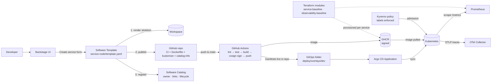

# Architecture

## Component responsibilities

| Component | Responsibility | Where it lives |
|---|---|---|
| Backstage | Self-service form + catalog | `backstage/` (run as separate app) |
| Software Template | Renders and publishes the golden path | `templates/service-node/` |
| Skeleton | The approved repo structure | `templates/service-node/skeleton/` |
| GitHub Actions | lint, test, build, **Cosign sign**, push | in the skeleton, `.github/workflows/ci.yaml` |
| Argo CD | Applies manifests from the generated repo | in the skeleton, `deploy/argocd/` |
| Terraform | Per-service cloud resources (registry, logs, alarms) | `terraform-modules/` |
| Kyverno | Admission gate: labels must exist | `policies/` |

## The key design choice

The template does **not** call Terraform or Argo directly. It generates a
repo whose structure *is* the golden path — the CI workflow, the manifests,
the catalog file. Existing machinery (GitHub, Argo, Prometheus) then works
on it with zero extra wiring. Governance by construction: services created
outside the template are the exception, and Kyverno is the backstop.
