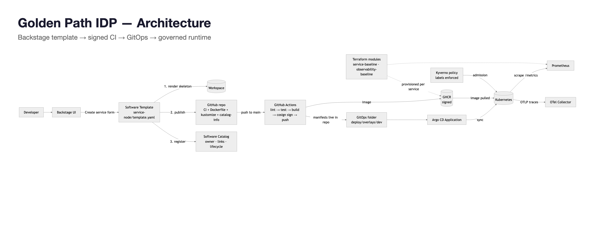
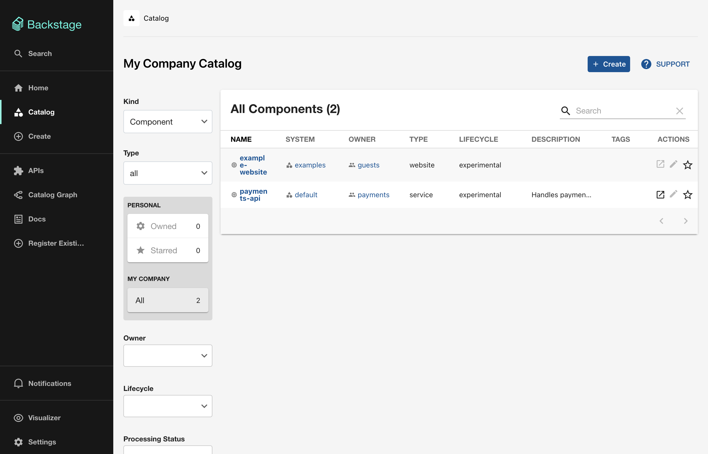
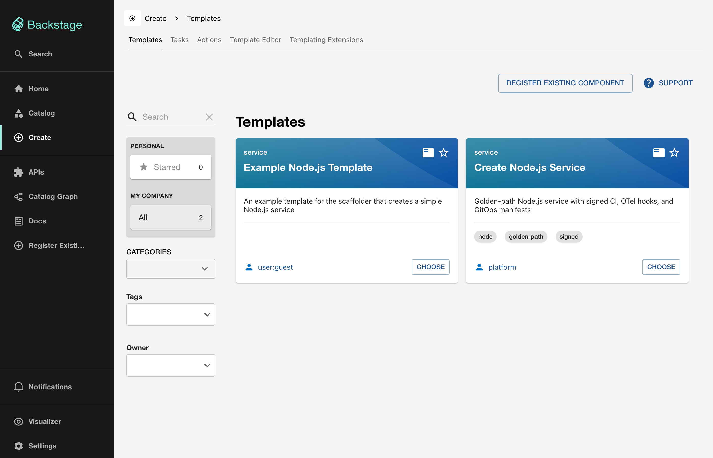
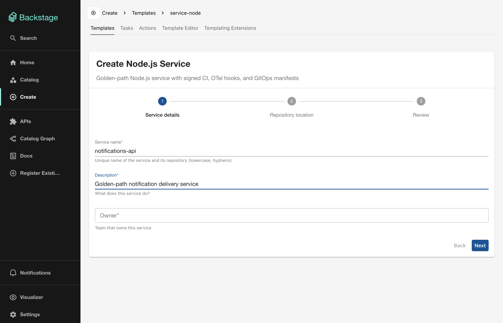
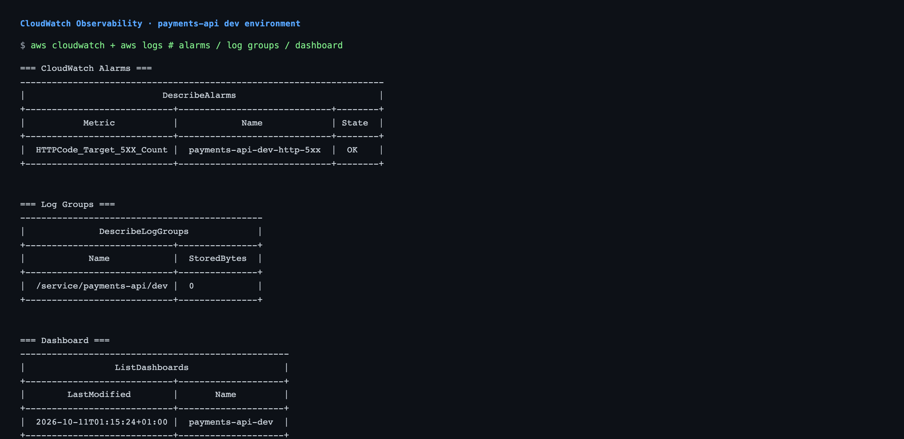
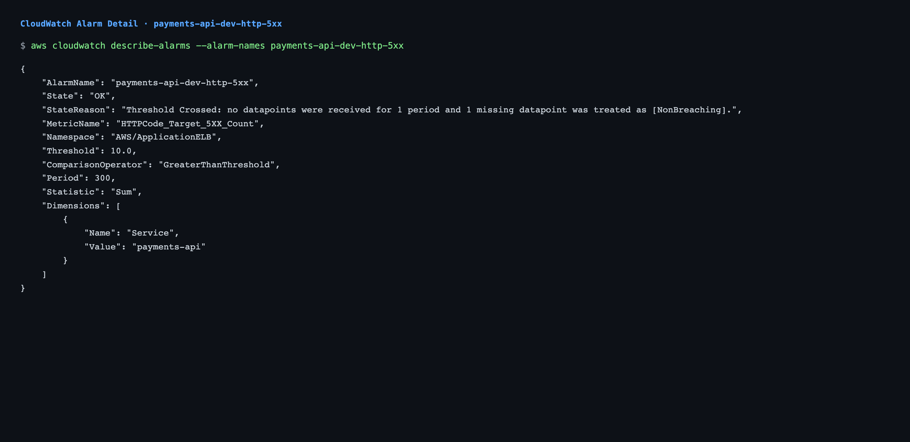
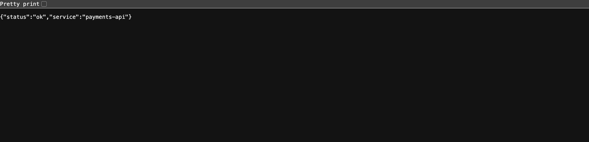
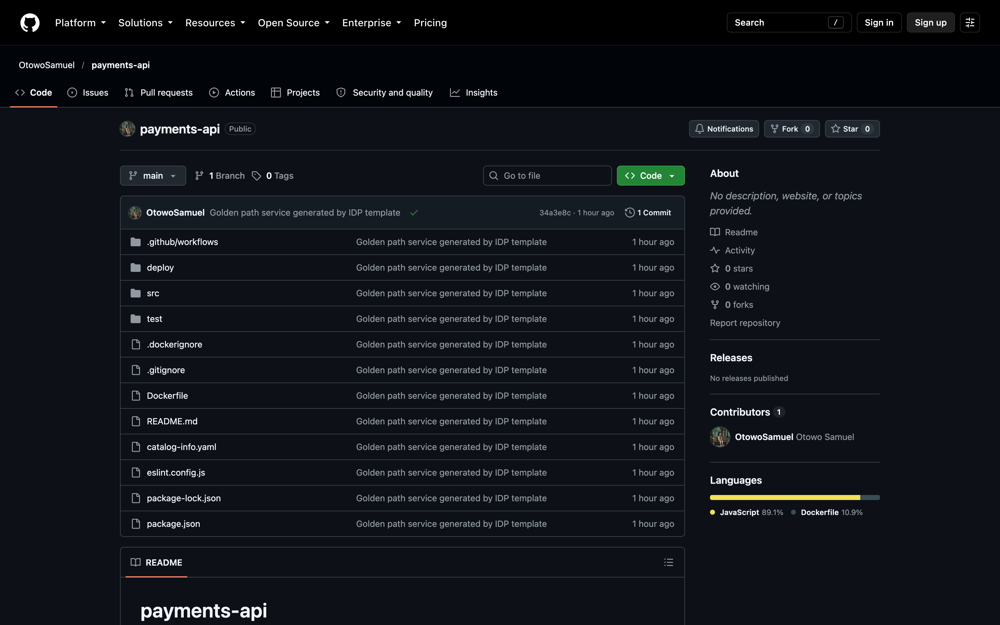
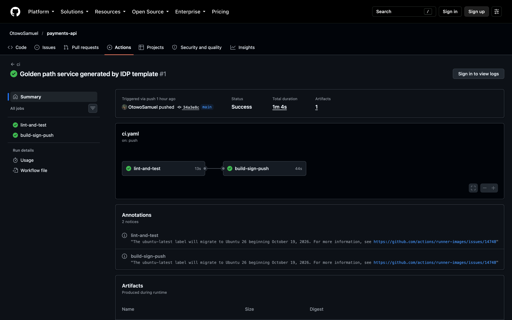

`The Golden Path Is a Repository: How I Built an Internal Developer Platform Starter

<!--
PUBLISHING CHECKLIST (Medium doesn't import local images — upload manually):
1. Cover image: assets/cover.png  → set as the article's cover in the editor
2. Architecture diagram: assets/architecture.png → insert right after
   "The flow, in one line" (this spot is marked below)
3. assets/screenshots/github-repo.png → "The results", first slot
4. assets/screenshots/github-actions-run.png → "The results", second slot
5. assets/screenshots/service-health.png → after Decision 5
6. Optional alternative diagram: assets/architecture-aws.png
7. assets/screenshots/backstage-create.png → Decision 1, first shot
8. assets/screenshots/backstage-form.png → Decision 1, second shot
9. assets/screenshots/backstage-catalog.png → after "unowned service is an unmanaged service"
10. assets/screenshots/live/live-health-url.png → public /health endpoint on ELB
11. assets/screenshots/live/live-argo-app.png → Argo CD: payments-api-dev Synced + Healthy
12. assets/screenshots/live/live-kyverno-deny.png → unlabeled Deployment denied by Kyverno
13. assets/screenshots/live/live-kyverno-allow.png → labeled Deployment admitted by Kyverno
14. assets/screenshots/live/live-aws-resources.png → ECR repo + log group + 5xx alarm (terraform)
15. assets/screenshots/live/live-cluster-runtime.png → cluster runtime with deployed image
16. assets/screenshots/live/live-backstage-create.png → Backstage create → template card
17. assets/screenshots/live/live-backstage-catalog.png → catalog ingests generated payments-api
18. assets/screenshots/live/live-cloudwatch-alarms.png → CloudWatch alarms list (5xx alarm OK)
19. assets/screenshots/live/live-cloudwatch-alarm-detail.png → alarm detail: threshold, metric, state
20. assets/screenshots/live/live-cloudwatch-logs.png → CloudWatch log groups for services
21. assets/screenshots/live/live-cloudwatch-dashboard.png → CloudWatch dashboard created via Terraform
22. assets/screenshots/live/live-cloudwatch-overview.png → combined: alarms + logs + dashboard
-->

*Every platform team eventually writes the same onboarding doc: "create a repo, add a Dockerfile, wire up CI, add these labels…" — and every new service ignores half of it. I built a starter that turns that doc into a portal click.*

---

There's a specific kind of tech debt that doesn't show up in any tracker: **copy-paste drift**. A team clones an old service's repo to start a new one, inherits a deprecated CI action, keeps the Dockerfile from three Node versions ago, and drops the labels their own policy engine requires. Six months later, nobody knows which services are compliant and which are archaeology.

The fix isn't more documentation. It's a **golden path**: a self-service template that generates repos which are correct *by construction*.

I built one as a portfolio project — an IDP starter with Backstage at the front, a signed supply chain in the middle, and GitOps at the back. Here's the architecture, the five decisions that shaped it, and the bugs that taught me the most.

## The flow, in one line

```
Developer → Backstage form → template renders golden-path repo →
CI signs the image → Argo CD syncs manifests → catalog shows ownership
```

<!-- INSERT assets/architecture.png HERE (after this code block) -->


The stack: **Backstage** (Software Templates v1beta3), **GitHub Actions** with **Cosign keyless** signing, **Terraform** modules for baseline infrastructure, **Argo CD** for GitOps, **Kyverno** for admission policy, and **OpenTelemetry** plumbed in from line one. Everything generated gets ownership metadata in the catalog — because an unowned service is an unmanaged service.

<!-- INSERT assets/screenshots/backstage-catalog.png HERE -->


## Decision 1: The template generates a repo, not infrastructure

The scaffolder renders files, pushes a repo, registers the catalog entry. That's it. No `terraform apply` at click time, no cluster calls.

The click, from the developer's side: pick the golden path from the portal…

<!-- INSERT assets/screenshots/backstage-create.png HERE -->


…fill in three fields (the repo, the CI, the GitOps manifests are not among them)…

<!-- INSERT assets/screenshots/backstage-form.png HERE -->


**Why:** every external call is a way for the template to fail for reasons unrelated to the developer's request. And the generated repo is *inspectable* — a reviewer opens GitHub and sees exactly what the platform approved. The trade-off is that provisioning happens on the first pipeline run instead of instantly. For a starter, a working, signed repo in under 15 minutes beats half-provisioned infrastructure.

## Decision 2: Sign images keyless, or not at all

The #1 reason teams skip image signing is key management. So the CI uses Cosign's **keyless mode with GitHub OIDC** — no key material anywhere in the repo, and verification is tied to the exact repository/workflow identity:

```yaml
- run: cosign sign --yes "${{ steps.image.outputs.name }}@${{ steps.build.outputs.digest }}"
- run: |
    cosign verify ... \
      --certificate-identity-regexp "https://github.com/${GITHUB_REPOSITORY}/" \
      --certificate-oidc-issuer https://token.actions.githubusercontent.com
```

All five Actions in the pipeline are **SHA-pinned to their release commits** — a pipeline that verifies everything else shouldn't float on mutable tags itself.

## Decision 3: Tests that need zero cloud credentials

This is the decision I'd defend hardest. The Terraform modules use `mock_provider "aws"`, and a Node render test scaffolds the template offline and runs the *generated repo's* lint and unit tests against the output.

**Why:** a portfolio project gets judged by whoever clones it — possibly with no AWS account, possibly on a plane. Tests that need credentials don't get run. Both suites finish in seconds, offline.

## Decision 4: One policy, not a policy library

The Kyverno policy requires two labels (`app.kubernetes.io/name`, `team`) on every workload. Generated services carry them automatically — so the policy exists to stop *hand-made* services from reaching the cluster unowned. One policy proves the compliance loop. Thirty policies *become* the project.

And yes, it's written as a Kubernetes-native **CEL `ValidatingPolicy`** — more on that below.

## Decision 5: Observability that starts on first run

The OpenTelemetry SDK initializes **only** if `OTEL_EXPORTER_OTLP_ENDPOINT` is set; otherwise it logs "tracing disabled" and the server runs. A generated service must start with zero external dependencies. The wiring, labels, and Prometheus annotations are all there — the hook exists, you plug in the collector when you have one.

The Terraform `observability-baseline` module provisions the CloudWatch side: a log group (`/service/<name>/<env>`) and a 5xx alarm on the load balancer. Both are created per-service, tagged, and ready before the first pod starts.

<!-- INSERT assets/screenshots/live/live-cloudwatch-overview.png HERE -->


The alarm watches `HTTPCode_Target_5XX_Count` on the ALB — threshold 10, over two 5-minute periods. It's the cheapest possible safety net: no custom metrics, no agent, just the one number that means "something is broken."

<!-- INSERT assets/screenshots/live/live-cloudwatch-alarm-detail.png HERE -->


And because the app exposes `/metrics` (Prometheus format) and ships OTel hooks from line one, plugging in a real collector later means setting one environment variable — not rewriting the service.

<!-- INSERT assets/screenshots/service-health.png HERE -->


## The five bugs worth writing down

**1. Deprecated APIs don't announce themselves politely.** I initially wrote the admission policy as a Kyverno `ClusterPolicy` — then checked the docs properly: deprecated in v1.19 (August 2026), *removed* in v1.20. Shipping it would have meant a policy that silently stops working within one release cycle. Migrating to a CEL `ValidatingPolicy` was the first real lesson: **verify your "standard" patterns against the current release, not your memory.**

**2. Invented config keys fail silently — until deploy.** My Backstage guest-auth config used `enabled: true` and `allowOutsideOfVisitor` — neither exists. The real API is `guest: {}` with an ominously-named `dangerouslyAllowOutsideDevelopment` escape hatch. Reading the provider's `config.d.ts` took 30 seconds and saved a broken startup.

**3. zsh doesn't word-split like bash.** A loop fetching Action SHAs with `set -- $spec` passed the whole string as one argument:

```
fatal: unable to access 'https://github.com/actions/checkout v7.0.1.git/': URL rejected: Malformed input
```

The fix — explicit parameter expansion (`repo="${spec%% *}"`) — is elementary. The lesson is better: **my test command and my shell disagree**, and the error message pointed at git, not at me.

**4. The test claimed more than it ran.** My README said `npm test` "renders template → lint → unit tests." It rendered. That's all. A claim in a README is a contract with whoever clones the repo — so I made the test actually run `npm ci`, lint, and unit tests on the rendered output. *Make the claim true or delete it.*

**5. A lockfile with a template variable inside it.** For `npm ci` to work in generated repos, the skeleton ships a `package-lock.json` — whose `name` field contains `${{ values.service_name }}`. Generating it meant swapping placeholders for literals, running `npm install --package-lock-only`, then swapping them back — and asserting after every render that both name fields resolved correctly.

## The results

| Metric | Value |
|---|---|
| Portal click → signed, working repo | **< 15 minutes** |
| Generated services with Cosign signing | **100%** — it lives in the template |
| Generated services with catalog ownership | **100%** — rendered, never hand-written |
| Reusable Terraform modules (tested, mocked) | **2**, 8/8 tests passing |
| Credentials needed to run every test | **0** |
| Template render test | 19 files, lint + unit tests green on output |

The repo also ships its own receipts: an architecture diagram, a decision log (decision / why / trade-off), a full build log of every command and failure, and a rebuild guide so someone can reconstruct the whole thing from an empty folder.

The demo run: the template rendered **[payments-api](https://github.com/OtowoSamuel/payments-api)** — every file golden-path-generated, one green check on the initial commit.

<!-- INSERT assets/screenshots/github-repo.png HERE -->


The pipeline that ran on that push: lint and unit tests first, then build → Cosign keyless sign → verify, 1m 4s end to end.

<!-- INSERT assets/screenshots/github-actions-run.png HERE -->


## Takeaways

1. **Golden paths beat guidelines.** A policy that has to be *remembered* will be forgotten; a template that's *used* can't be.
2. **Keyless signing removed the excuse.** Zero secrets, zero key management — the reason teams skip signing.
3. **Offline tests are a feature of the demo, not just the code.** Anyone who clones it gets green in under two minutes.
4. **Currency is maintenance.** Every pin — Actions, Node LTS, provider majors, policy APIs — was verified against October 2026 releases. A golden path with stale pins is self-defeating.
5. **Write the README first, then make it true.** Half my "bugs" were really gaps between what I claimed and what I ran.

---

*Source: https://github.com/OtowoSamuel/idp-golden-path — rebuild guide and full build log included; the generated demo service lives at https://github.com/OtowoSamuel/payments-api. Built as Project 2 of a platform-engineering portfolio; Project 1 (GitOps + policy + supply chain) is the delivery engine underneath.*
